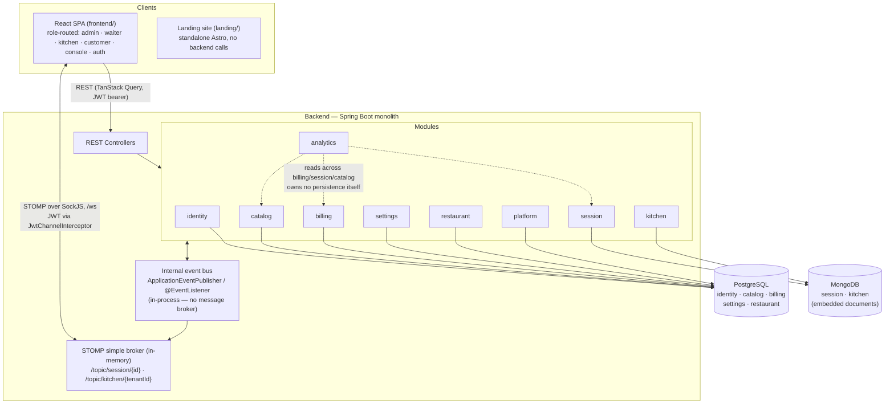
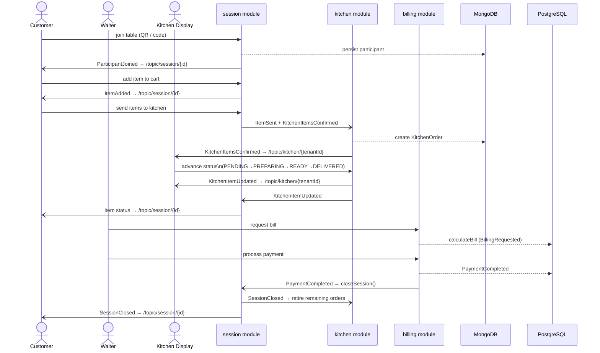

# Ember — System Architecture

Ember is a multi-tenant, modular-monolith restaurant management platform. This
document shows how the deployable systems connect, and how a request/event
flows through the backend during the core order lifecycle.

## 1. System Connection Diagram

Notes:
- The frontend is **one** React SPA; admin/waiter/kitchen/customer/console are
  routed sections of it, not separate apps.
- `landing/` is a fully standalone Astro site with no runtime dependency on
  the backend (its contact form makes no API call).
- PostgreSQL uses JPA discriminator-based multi-tenancy
  (`TenantContextHolder` / `TenantIdentifierResolver`); MongoDB documents
  (`Session`, `KitchenOrder`) carry `tenantId` directly, with every finder
  routed tenant-first.
- There is no Kafka/RabbitMQ. Cross-module communication inside the backend
  is 100% synchronous, in-process `ApplicationEventPublisher` /
  `@EventListener`.
- The STOMP broker is an in-memory simple broker living inside the same
  backend process — not a separate infrastructure component.

## 2. Order Lifecycle — Sequence Diagram

Traced directly from the event wiring in `SessionService`, `KitchenService`,
`PaymentService`, and the `*WebSocketListener` / `*EventListener` classes.

## 3. Data Stores

| Store | Owning modules | Notes |
|---|---|---|
| PostgreSQL | identity, catalog, billing, settings, restaurant, platform | JPA, discriminator multi-tenancy via `@TenantId`; `platform` tables (`PlatformOperator`, `PlatformAuditLog`) have no tenant FK by design |
| MongoDB | session, kitchen | Document models with embedded participants / order items; no replica set — fail-fast validation instead of `@Transactional` |
